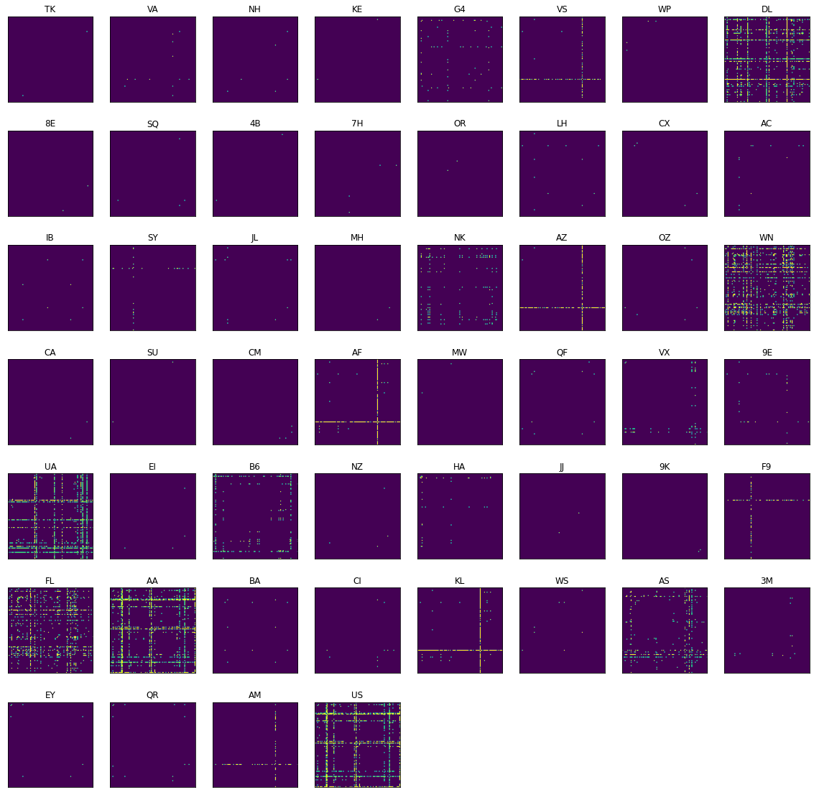

```python
import numpy as np
import matplotlib.pyplot as plt
import pandas as pd
```


```python
routes_url = "https://raw.githubusercontent.com/jpatokal/openflights/master/data/routes.dat"
routes_df = pd.read_csv(routes_url, header=None)
routes_df.columns = ["airline", "id", "source", "source_id", "target", "target_id", "codeshare", "stops",
                     "equipments"]

routes_df = routes_df[["airline", "id", "source", "source_id", "target", "target_id"]]
routes_df.head()
```


<div>
<style scoped>
    .dataframe tbody tr th:only-of-type {
        vertical-align: middle;
    }

    .dataframe tbody tr th {
        vertical-align: top;
    }

    .dataframe thead th {
        text-align: right;
    }
</style>
<table border="1" class="dataframe">
  <thead>
    <tr style="text-align: right;">
      <th></th>
      <th>airline</th>
      <th>id</th>
      <th>source</th>
      <th>source_id</th>
      <th>target</th>
      <th>target_id</th>
    </tr>
  </thead>
  <tbody>
    <tr>
      <th>0</th>
      <td>2B</td>
      <td>410</td>
      <td>AER</td>
      <td>2965</td>
      <td>KZN</td>
      <td>2990</td>
    </tr>
    <tr>
      <th>1</th>
      <td>2B</td>
      <td>410</td>
      <td>ASF</td>
      <td>2966</td>
      <td>KZN</td>
      <td>2990</td>
    </tr>
    <tr>
      <th>2</th>
      <td>2B</td>
      <td>410</td>
      <td>ASF</td>
      <td>2966</td>
      <td>MRV</td>
      <td>2962</td>
    </tr>
    <tr>
      <th>3</th>
      <td>2B</td>
      <td>410</td>
      <td>CEK</td>
      <td>2968</td>
      <td>KZN</td>
      <td>2990</td>
    </tr>
    <tr>
      <th>4</th>
      <td>2B</td>
      <td>410</td>
      <td>CEK</td>
      <td>2968</td>
      <td>OVB</td>
      <td>4078</td>
    </tr>
  </tbody>
</table>
</div>


```python
airport_url = "https://raw.githubusercontent.com/jpatokal/openflights/master/data/airports.dat"
airport_df = pd.read_csv(airport_url, header=None)
airport_df.columns = ["airport_id", "name", "city", "country", "iata", "icao", "lat", "long", "altitude", "tmz",
                      "dst", "tzt", "type", "source"]

airport_df = airport_df[["airport_id", "iata", "icao", "country", "city", "name"]]
airport_df.head()
```


<div>
<style scoped>
    .dataframe tbody tr th:only-of-type {
        vertical-align: middle;
    }

    .dataframe tbody tr th {
        vertical-align: top;
    }

    .dataframe thead th {
        text-align: right;
    }
</style>
<table border="1" class="dataframe">
  <thead>
    <tr style="text-align: right;">
      <th></th>
      <th>airport_id</th>
      <th>iata</th>
      <th>icao</th>
      <th>country</th>
      <th>city</th>
      <th>name</th>
    </tr>
  </thead>
  <tbody>
    <tr>
      <th>0</th>
      <td>1</td>
      <td>GKA</td>
      <td>AYGA</td>
      <td>Papua New Guinea</td>
      <td>Goroka</td>
      <td>Goroka Airport</td>
    </tr>
    <tr>
      <th>1</th>
      <td>2</td>
      <td>MAG</td>
      <td>AYMD</td>
      <td>Papua New Guinea</td>
      <td>Madang</td>
      <td>Madang Airport</td>
    </tr>
    <tr>
      <th>2</th>
      <td>3</td>
      <td>HGU</td>
      <td>AYMH</td>
      <td>Papua New Guinea</td>
      <td>Mount Hagen</td>
      <td>Mount Hagen Kagamuga Airport</td>
    </tr>
    <tr>
      <th>3</th>
      <td>4</td>
      <td>LAE</td>
      <td>AYNZ</td>
      <td>Papua New Guinea</td>
      <td>Nadzab</td>
      <td>Nadzab Airport</td>
    </tr>
    <tr>
      <th>4</th>
      <td>5</td>
      <td>POM</td>
      <td>AYPY</td>
      <td>Papua New Guinea</td>
      <td>Port Moresby</td>
      <td>Port Moresby Jacksons International Airport</td>
    </tr>
  </tbody>
</table>
</div>


```python
us_airport_df = airport_df[airport_df.country == "United States"]
us_airport_df.head()
```


<div>
<style scoped>
    .dataframe tbody tr th:only-of-type {
        vertical-align: middle;
    }

    .dataframe tbody tr th {
        vertical-align: top;
    }

    .dataframe thead th {
        text-align: right;
    }
</style>
<table border="1" class="dataframe">
  <thead>
    <tr style="text-align: right;">
      <th></th>
      <th>airport_id</th>
      <th>iata</th>
      <th>icao</th>
      <th>country</th>
      <th>city</th>
      <th>name</th>
    </tr>
  </thead>
  <tbody>
    <tr>
      <th>3212</th>
      <td>3411</td>
      <td>BTI</td>
      <td>PABA</td>
      <td>United States</td>
      <td>Barter Island</td>
      <td>Barter Island LRRS Airport</td>
    </tr>
    <tr>
      <th>3213</th>
      <td>3412</td>
      <td>\N</td>
      <td>PAWT</td>
      <td>United States</td>
      <td>Fort Wainwright</td>
      <td>Wainwright Air Station</td>
    </tr>
    <tr>
      <th>3214</th>
      <td>3413</td>
      <td>LUR</td>
      <td>PALU</td>
      <td>United States</td>
      <td>Cape Lisburne</td>
      <td>Cape Lisburne LRRS Airport</td>
    </tr>
    <tr>
      <th>3215</th>
      <td>3414</td>
      <td>PIZ</td>
      <td>PPIZ</td>
      <td>United States</td>
      <td>Point Lay</td>
      <td>Point Lay LRRS Airport</td>
    </tr>
    <tr>
      <th>3216</th>
      <td>3415</td>
      <td>ITO</td>
      <td>PHTO</td>
      <td>United States</td>
      <td>Hilo</td>
      <td>Hilo International Airport</td>
    </tr>
  </tbody>
</table>
</div>


```python
kept_iata = set(us_airport_df.iata.tolist())
kept_icao = set(us_airport_df.icao.tolist())
kept_codes = kept_iata.union(kept_icao)

us_routes = routes_df[routes_df.source.isin(kept_codes)]
us_routes = us_routes[us_routes.target.isin(kept_codes)]

len(us_routes)
```


    10518


```python
# keep only topK most popular
from collections import Counter

topK = 100
cnt = Counter(us_routes.source.tolist())
cnt.update(us_routes.target.tolist())

kept_codes = sorted([(k, v) for k, v in cnt.items()], key=lambda x: x[1], reverse=True)
kept_codes = [k for k, _ in kept_codes[:topK]]

kept_routes = us_routes[us_routes.source.isin(kept_codes)]
kept_routes = kept_routes[kept_routes.target.isin(kept_codes)]
```

# Convert into Matrices


```python
networks = {}
airlines = list(set(kept_routes.airline))
airports = list(set(kept_routes.source).union(set(kept_routes.target)))
airport2ind = {k: i for i, k in enumerate(airports)}
```


```python
for airl in airlines:
    curr = kept_routes[kept_routes.airline == airl].copy()
    net = np.zeros((len(airports), len(airports)))
    for ind, row in curr.iterrows():
        net[airport2ind[row.source], airport2ind[row.target]] = 1
        net[airport2ind[row.target], airport2ind[row.source]] = 1
        
    networks[airl] = net.astype(np.int32)
```


```python
fig, axes = plt.subplots(7, 8, figsize=(20, 20))
axes = axes.flat

for i, air in enumerate(airlines):
    axes[i].set_title(air)
    axes[i].imshow(networks[air])
    axes[i].set_xticks([])
    axes[i].set_yticks([])
    
for i in range(52, 56):
    axes[i].set_visible(False)

plt.show()
```





```python
basefile = "data/airline_network/{0}.csv"

for airline, net in networks.items():
    file = basefile.format(airline)
    np.savetxt(file, net, fmt='%i', delimiter=",")
```

